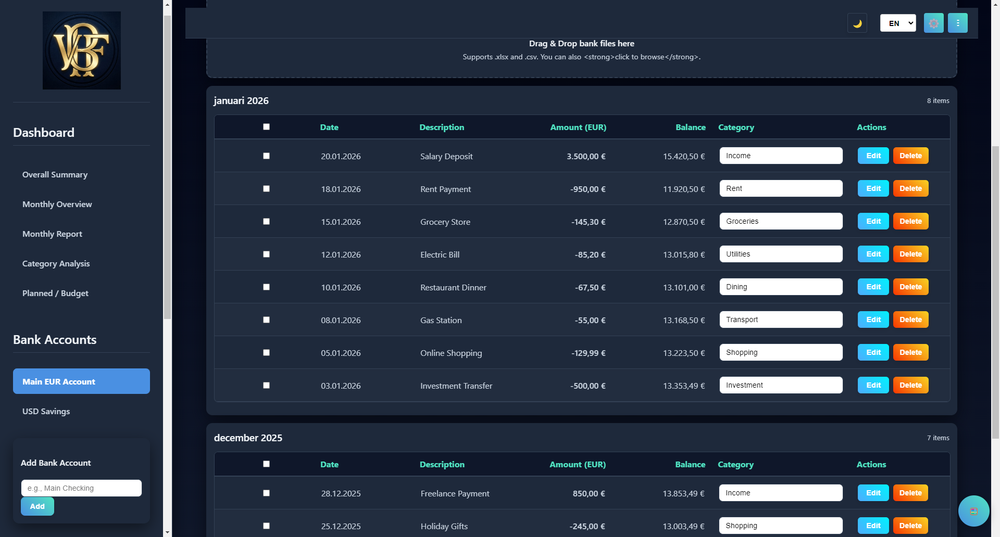
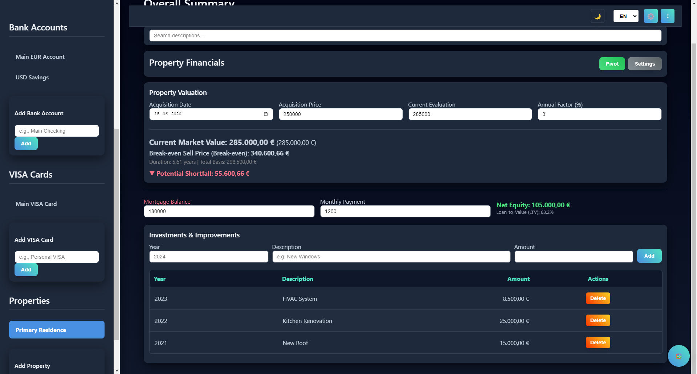
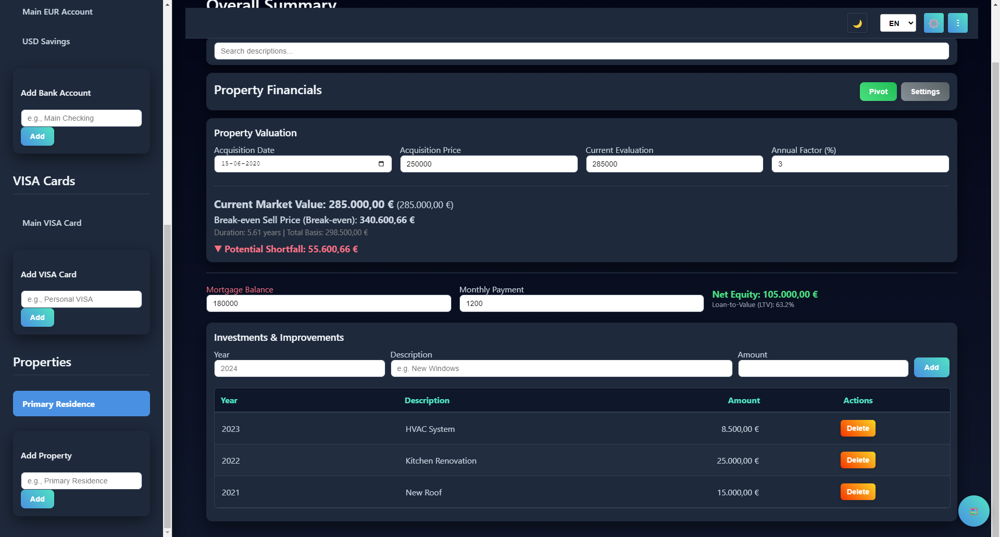
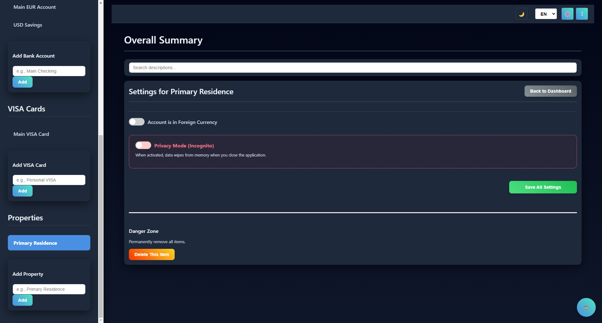
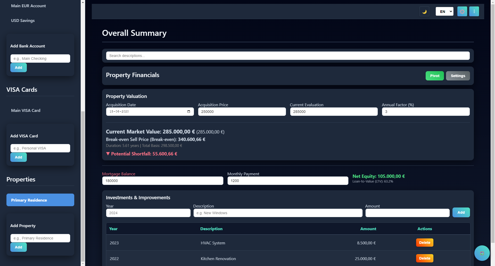
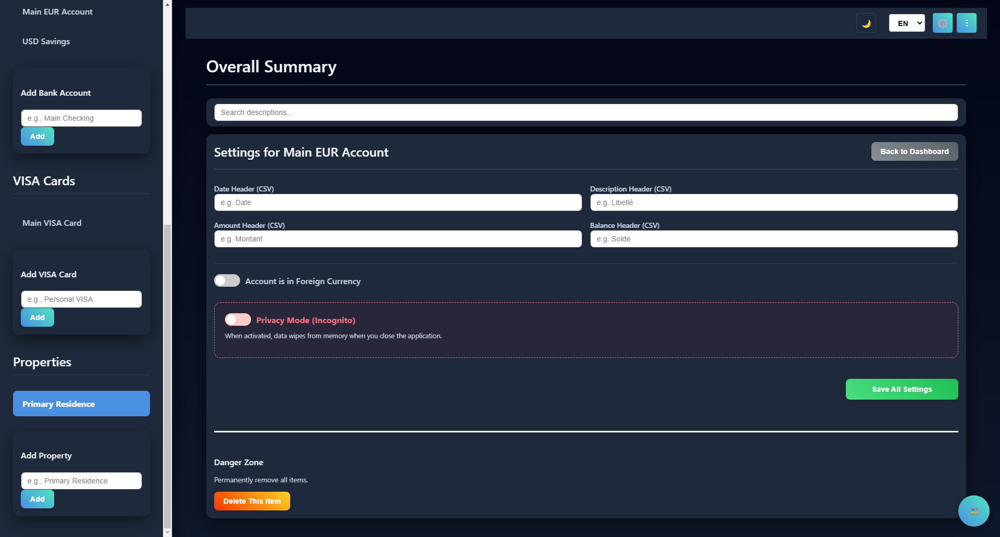

  

<h1 align="center">BudgetPro Navigator</h1>

  <strong>Offline Personal Finance App — Budget, Wealth & Property Tracker</strong> 
  100% offline · AES-256 encrypted · No cloud · No subscription

  <a href="https://github.com/VBFPRONavigator/vbf-budget-pro/releases/latest">⬇ Download Latest Release</a> ·
  <a href="https://vbfpronavigator.github.io/vbf-budget-pro/marketing.html">🌐 Website</a> ·
  <a href="#screenshots">📸 Screenshots</a>

---

## What is BudgetPro Navigator?

**BudgetPro Navigator** is a premium offline personal finance application for **Windows** and **Android**. All your financial data stays on your device — no cloud, no servers, no subscriptions. Your data is encrypted with **AES-256** and never leaves your machine.

One-time license: **€25** — no recurring fees, ever.

---

## Key Features

| Feature | Description |
|---|---|
| 💰 **Multi-Currency Accounts** | Manage bank accounts in EUR, USD, GBP, CHF, and more |
| 💳 **VISA Card Tracking** | Import and reconcile VISA card transactions |
| 🏠 **Real Estate Portfolio** | Track property investments, rental yields, loan amortization |
| 📊 **Advanced Analytics** | Budget vs. Actual, forecasting, financial health score |
| 📈 **ECB Market Data** | Live ECB exchange rates and interest rate data |
| 🤖 **AI Categorization** | Smart automatic transaction categorization |
| 🔐 **AES-256 Encryption** | Military-grade local encryption for all data |
| 🌙 **Dark Mode** | Full dark mode support |
| 🌍 **5 Languages** | English, French, German, Spanish, Portuguese |
| 📖 **Built-in Guide** | Comprehensive 8-tab user guide |
| 📤 **Excel Import/Export** | Import from and export to .xlsx files |
| 🛡️ **100% Offline** | Zero cloud dependency — your data never leaves your device |

---

## Screenshots

   
  <em>Dashboard — Overview of accounts, budgets and net worth</em>

   
  <em>Budgets — Budget vs. Actual tracking with visual charts</em>

   
  <em>Reports — Advanced analytics and financial forecasting</em>

   
  <em>Privacy — AES-256 encrypted local-only storage</em>

   
  <em>Property — Real estate portfolio with rental yield analysis</em>

   
  <em>Account Settings — Multi-currency account management</em>

---

## Download & Installation

### Windows (Desktop)

1. Go to the [**Releases**](https://github.com/VBFPRONavigator/vbf-budget-pro/releases/latest) page
2. Download the `.msi` installer
3. Run the installer — BudgetPro Navigator is ready to use

### Android

Available as direct APK download from the [Releases](https://github.com/VBFPRONavigator/vbf-budget-pro/releases/latest) page.

---

## Platforms

| Platform | Status |
|---|---|
| Windows 10/11 | ✅ Available |
| Android | ✅ Available |
| macOS | 🔜 Planned |
| Linux | 🔜 Planned |

---

## Privacy & Security

- **100% Offline** — No internet connection required, no data sent anywhere
- **AES-256 Encryption** — All financial data encrypted on disk
- **No Telemetry** — Zero analytics, zero tracking
- **No Cloud** — No accounts, no sign-ups, no servers
- **Local Backups** — Encrypted backup/restore to your own files

---

## Support

- 📧 Email: usethis1234@proton.me
- 📖 Built-in User Guide with 8 comprehensive tabs
- 🐛 [Report an issue](https://github.com/VBFPRONavigator/vbf-budget-pro/issues)

---

## Changelog

### v1.0.0.8 (Latest)
- Enhanced property investment analytics
- Improved VISA reconciliation
- ECB market data integration
- Performance optimizations

### v1.0.0 (Initial Release)
- Multi-currency account management
- VISA card tracking & reconciliation
- Real estate portfolio with rental yield analysis
- AI-powered transaction categorization
- Multi-language interface (EN, FR, DE, ES, PT)
- AES-256 local data encryption
- Excel import/export
- Built-in comprehensive user guide

---

  <strong>BudgetPro Navigator</strong> — Take control of your finances, offline. 
  <em>© 2025–2026 VBF PRO. All Rights Reserved.</em>

